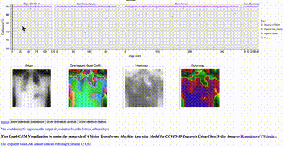

# Animated2GradCAM:   Grad CAM Visualized & Interactive
This repository is devoted to making image classification results Grad-CAM-visualized and interactive.

I developed this repository during our research Papers: [A Vision Transformer Machine Learning Model for COVID-19 Dagnosis Using Chest X-Ray Images](https://github.com/TyBruceChen/Research-A-Fined-Tuned-ViT-for-COVID-19-Image-Auxiliary-Diagnosing/tree/main) (DOI: 10.1016/j.health.2024.100332) and [A Highly Secure and Accurate System for COVID-19 Diagnosis from Chest X-ray Images](https://github.com/TyBruceChen/AI-Telehealth-System-with-ViT-and-Kyper-Cryptography) (DOI: 10.1109/MWSCAS60917.2024.10658795).

Specifically, I would like to thank Dr. Toby Hocking, who introduced and created the powerful [animint2](https://github.com/animint/animint2) R package.

E.X.:



Instances:
1. [Model prediction visualized in 200*200 pixel 696 cases in COVID-19 chest X-ray dataset](https://github.com/TyBruceChen/Animated2GradCAM-COVID19-Chest-X-ray-ViT-V2-200px-696Case) [Web](https://github.com/TyBruceChen/Animated2GradCAM-COVID19-Chest-X-ray-ViT-V1-100px-809Case)
2. [Model prediction visualized in 100*100 pixel 809 cases in COVID-19 chest X-ray dataset](https://github.com/TyBruceChen/Animated2GradCAM-COVID19-Chest-X-ray-ViT-V1-100px-809Case) [Web](https://tybrucechen.github.io/Animated2GradCAM-COVID19-Chest-X-ray-ViT-V2-200px-696Case/)
3. [Animated2GradCAM-COVID19-Chest-X-ray-ViT-V3-140px-609Case: Sync Grad-CAM images](https://github.com/TyBruceChen/Animated2GradCAM-COVID19-Chest-X-ray-ViT-V3-140px-609Case) [Web](https://tybrucechen.github.io/Animated2GradCAM-COVID19-Chest-X-ray-ViT-V3-140px-609Case/)
4. [Animated2GradCAM-COVID19-Chest-X-ray-ViT-V5-140px-609Case: Sync Grad-CAM images-modified](https://github.com/TyBruceChen/Animated2GradCAM-COVID19-Chest-X-ray-ViT-V5-140px-609Case--Final) [Web](https://tybrucechen.github.io/Animated2GradCAM-COVID19-Chest-X-ray-ViT-V5-140px-609Case/)
5. [ResNet50-Image-Classification-COVID19-chest-Xray-dataset](https://github.com/TyBruceChen/TyBruceChen-Animated2GradCAM-COVID19-Chest-X-ray-ResNet50-140px-431Case) [Web](https://tybrucechen.github.io/TyBruceChen-Animated2GradCAM-COVID19-Chest-X-ray-ResNet50-140px-431Case/)
6. [DenseNet121-Image-Classification-COVID19-chest-Xray-dataset](https://github.com/TyBruceChen/Animated2GradCAM-COVID19-Chest-X-ray-DesnseNet121-140px-431Case) [Web](https://tybrucechen.github.io/Animated2GradCAM-COVID19-Chest-X-ray-DesnseNet121-140px-431Case/)
7. [EfficientNetB0-Image-Classification-COVID19-chest-Xray-dataset](https://github.com/TyBruceChen/Animated2GradCAM-COVID19-Chest-X-ray-EfficientNetB0-140px-431Case) [Web](https://tybrucechen.github.io/Animated2GradCAM-COVID19-Chest-X-ray-EfficientNetB0-140px-431Case/)

This repository should work on most CNN and ViT structured models. (Model successfully went through the test: ResNet50, DenseNet121, EfficientNetB0, ViT-patch16) <br>
Used Grad-CAM code in Python is from my repository: [Grad-CAM-pytorch---Understand-deep-learning-from-higher-view](https://github.com/TyBruceChen/Grad-CAM-pytorch---Understand-deep-learning-from-higher-view) based on this paper: [Grad-CAM: Visual Explanations from Deep Networks via Gradient-based Localization](https://arxiv.org/abs/1610.02391)

### How to use this repository ###

* #### [Required package installation](https://github.com/TyBruceChen/Animinted2GradCAM#1-install-required-package-)
* #### [Parameter configuration in Python file to generate CSV files](https://github.com/TyBruceChen/Animinted2GradCAM#2-modify-your-configuration-and-generate-the-csv-files-that-store-the-pixel-values)
* #### [Parameter configuration in R file to generate interactive visualization](https://github.com/TyBruceChen/Animinted2GradCAM#3-generate-visualization-files-through-r)
* #### [Push the viz through the GitHub Page (optional)](https://github.com/TyBruceChen/Animinted2GradCAM#4-check-the-visualization-and-upload-it-through-github-for-online-visualization)

#### 1. Install Required Package: <br>

Python:
```
import torch #pip install torch
from torch import nn
import timm  #pip intall timm

import numpy as np #pip install numpu
import pandas as pd #pip install pandas
from GradCAM import *
from nparr2csv import *
```
R:
```
library(animint2) #install.packages(animint2)
library(gert) #install.packages(gert)
```

#### 2. Modify your configuration and generate the csv files that store the pixel values:
Specify the path of your model: ```model_path = root_path + 'models/densenet121-lr_1e-3/COVID_balancedpaper1_.pt'```.

Specify the path of your image information txt file: ```test_file_path = root_path + 'processed/test.txt'```.
The content should contain each file's path along with its label format:```img_path (2 space) label```. <br>
sample:
```
./COVID-19_Radiography_Dataset\Normal\images\Normal-6722.png  2
./COVID-19_Radiography_Dataset\Lung_Opacity\images\Lung_Opacity-2231.png  1
./COVID-19_Radiography_Dataset\Normal\images\Normal-4755.png  2
./COVID-19_Radiography_Dataset\Lung_Opacity\images\Lung_Opacity-5100.png  1
./COVID-19_Radiography_Dataset\Normal\images\Normal-6684.png  2
./COVID-19_Radiography_Dataset\Normal\images\Normal-5928.png  2
./COVID-19_Radiography_Dataset\COVID\images\COVID-1896.png  0
```

Specify the actual name of each class corresponding to its numerical label ```class_list = ['COVID-19', 'Lung_Opacity','Normal','Pneumonia']```

Specify the index of the layer you want to  visualize: ```layer_idx = 3```

These are the basic configuration to run the python file: ```Animated2GradCAM.py```

There are 2 csv files generated in `Overall` model and 5 csv files generated in `Normal` mode (default)

#### 3. Generate visualization files through R:

Specify the path of each required csv file
sample:
```
path_name <- '~/Downloads/CSV_files_densenet121/temp_name-densenet121.csv'
plotmode<- '' #select the plot model: 'Overall': plot four in one graph, 
#other: plot in 4 separate graphs

path <- '~/Downloads/temp.csv'

path_origin <- '~/Downloads/CSV_files_densenet121/temp-densenet121-origin.csv'
path_overlapped <- '~/Downloads/CSV_files_densenet121/temp-densenet121-overlapped.csv'
path_heatmap <- '~/Downloads/CSV_files_densenet121/temp-densenet121-heatmap.csv'
path_colormap <- '~/Downloads/CSV_files_densenet121/temp-densenet121-colormap.csv'

title_animint <- 'Animated2Grad: CAM-COVID-19-chest-X-rays-DenseNet121-
visualization-140px-430cases' #the title of your plot
source_url <- 'https://github.com/TyBruceChen/Animinted2GradCAM' 
```

#### 4. Check the visualization and upload it through GitHub for online visualization


As shown above, the files are stored temporarily in local and you can copy it to another folder. Also, the visualization is online through your local part.

To push the content to GitHub, go inside the file folder,
```
git init .
git add .
git commit -m 'first commit'
pbcopy < (the path of your github public key)
git remote add origin git@github.com:(your github repository uploading URL: username/repository_name)
git push -u origin main
```

For modification (the folder is newly created and wanted to upload (merge with) the already-existed repository):
```
git pull origin main --allow-unrelated-histories
```
Synchronize the local repository with the remote (GitHub) repository, and allow them to have different origin histories. This step should happen after you add the public key path and remote repository location to the local repo.

Quit from vim editor: ```:wq```

After merging, push it to the main branch of the GitHub repository:
```
git push origin main
```

